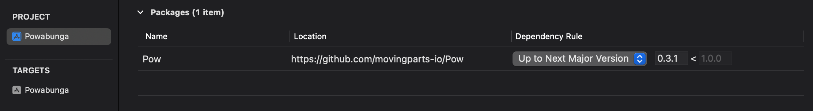
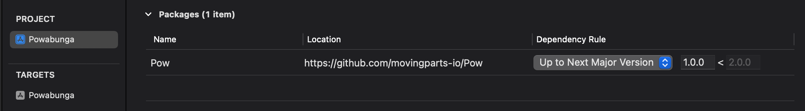
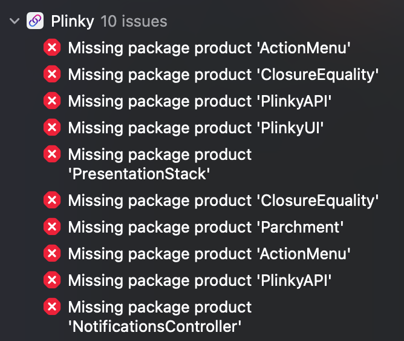
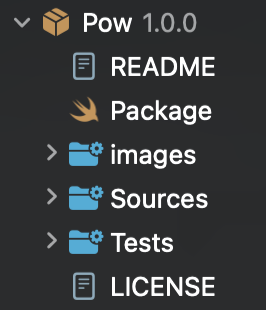

# 1.0 Update Guide 

If you are moving from a version of Pow below 1.0.0 the first thing you'll notice is that Pow is now open source. 🎉🎉🎉

Previously Pow was a paid product, and now it is a a community project operated and sponsored by [Emerge Tools](https://github.com/EmergeTools).

---

> [!NOTE]  
> Pow's version number has been bumped from 0.3.1 to 1.0.0, and despite this being a new major version there are **no breaking changes**.
> 
> Now that the Pow project is run by EmergeTools you should use the URL https://github.com/EmergeTools/Pow rather than https://github.com/movingparts-io/Pow.


### Integrate Pow 1.0.0+ into your app.

If you've integrated Pow through Xcode's Package Dependencies you will need to update the Pow package dependency to point to 1.0.0.

If you're using the default Up to Next Major Version rule you may need to manually update the version number to 1.0.0. Going from 0.x.x to 1.0.0 is considered a major version update, so Xcode will not do it automatically on your behalf for fear of breaking changes.



When you set Pow to version 1.0.0 in your Package Dependencies list it will now look like this.



If you're using Swift Package Manager you should update the URL and version number of any references you have to Pow.

> Before
> ```swift
> .package(url: "https://github.com/movingparts-io/Pow", from: Version(0, 3, 1))
> ```

> After
> ```swift
> .package(url: "https://github.com/EmergeTools/Pow", from: Version(1, 0, 0))
> ```

Sometimes Swift Package Manager will show errors like this after upgrading a dependency.



This is a long-standing issue with Xcode, not Pow. The solution of course is to close and re-open Xcode.



To confirm that Pow has been updated you can look at the list of installed Swift Packages in your project's File Navigator. (The first tab of Xcode's left sidebar.) If everything has gone correctly you will see Pow 1.0.0, and now that the framework is open source you will also see all of the source code.

---

### Remove Pow's License

Now that Pow is free, you too are free to remove this line of code that would validate your purchase of a Pow license.

```swift
Pow.unlockPow(reason: .iDidBuyTheLicense)
```

---

And that's it, easy as 0.1, 0.2, 0.3. If you run into any problems upgrading please file an [issue](gihtub.com/EmergeTools/Pow/issues), we're more than happy to help.