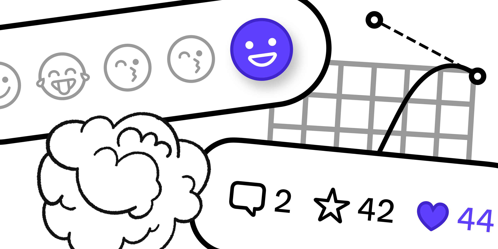

# Pow

[](https://swiftpackageindex.com/EmergeTools/Pow)
[](https://swiftpackageindex.com/EmergeTools/Pow)
[](https://www.emergetools.com/app/example/ios/pow.Pow/release?utm_campaign=badge-data)

Delightful SwiftUI effects for your app. 

[Check out other open source projects from Emerge Tools](https://www.emergetools.com/open-source)

# Installation

To add a package dependency to your Xcode project, select _File_ > _Add Package_ and enter this repository's URL (https://github.com/EmergeTools/Pow).

To add a package dependency to Swift Package, add this repository to your list of dependencies.
```swift
.package(url: "https://github.com/EmergeTools/Pow", from: Version(1, 0, 0))
```

And to your target as a product:
```swift
.product(name: "Pow", package: "Pow")
```

If you are moving from the previously closed source Pow framework to the new open source package, please refer to our [Transition Guide](). If you have any problems please file an [issue](https://github.com/EmergeTools/Pow/issues).

# Overview

Pow features a selection of [SwiftUI transitions](#transitions) as well as [Change Effects](#change-effects) that trigger every time a value is updated.

You can find previews of all effects [on the Pow website](https://movingparts.io/pow). If you have an iOS Developer Environment, you can check out the [Pow Example App](https://github.com/EmergeTools/Pow/tree/main/Example).

# Feedback & Contribution

This project provides multiple forms of delivering feedback to maintainers.

If you are figuring out how to use about Pow or one of it's effects we ask that you first consult the [effects examples page](https://movingparts.io/pow).

If you still have a question, enhancement, or a way to improve Pow, this project leverages GitHub's [Issues](https://github.com/EmergeTools/Pow/issues) to manage your requests. If you find a bug and wish to report it, an issue would be greatly appreciated.

# Requirements

- iOS 15.0+
- macOS 12.0
- Mac Catalyst 15.0+
- visionOS beta 6 (requires Xcode 15.1 beta 3)

## Change Effects

Change Effects are effects that will trigger a visual or haptic every time a value changes.

Use the `changeEffect` modifier and pass in an `AnyChangeEffect` as well as a value to watch for changes.

```swift
Button {
    post.toggleLike()
} label: {
    Label(post.likes.formatted(), systemName: "heart.fill")
}
.changeEffect(.spray { heart }, value: post.likes, isEnabled: post.isLiked)
.tint(post.isLiked ? .red : .gray)
```

You can choose from the following Change Effects: [Spray](#spray), [Haptic Feedback](#haptic-feedback), [Jump](#jump), [Ping](#ping), [Rise](#rise), [Shake](#shake), [Shine](#shine), and [Spin](#spin).

### Spray

[Preview](https://movingparts.io/pow/#spray)

An effect that emits multiple particles in different shades and sizes moving up from the origin point.

```swift
likeButton
  .changeEffect(
    .spray(origin: .center) { Image(systemName: "heart.fill") },
    value: likes
  )
```

- Parameters:
  - `origin`: The origin of the particles.
  - `layer`: The `ParticleLayer` on which to render the effect, default is `local`.
  - `particles`: The particles to emit.

```swift
static func spray(origin: UnitPoint = .center, layer: ParticleLayer = .local, @ViewBuilder _ particles: () -> some View) -> AnyChangeEffect
```

### Haptic Feedback

Triggers haptic feedback to communicate successes, failures, and warnings whenever a value changes.

- `notification`: The feedback type to trigger.

```swift
static func feedback(hapticNotification type: UINotificationFeedbackGenerator.FeedbackType) -> AnyChangeEffect
```

Triggers haptic feedback to simulate physical impacts whenever a value changes.

- `impact`: The feedback style to trigger.

```swift
static func feedback(hapticImpact style: UIImpactFeedbackGenerator.FeedbackStyle) -> AnyChangeEffect
```

Triggers haptic feedback to indicate a change in selection whenever a value changes.

```swift
static var feedbackHapticSelection: AnyChangeEffect
```

### Jump

[Preview](https://movingparts.io/pow/#jump)

Makes the view jump the given height and then bounces a few times before settling.

- `height`: The height of the jump.

```swift
static func jump(height: CGFloat) -> AnyChangeEffect
```

### Ping

[Preview](https://movingparts.io/pow/#ping)

Adds one or more shapes that slowly grow and fade-out behind the view.

The shape will be colored by the current tint style.

- Parameters:
  - `shape`: The shape to use for the effect.
  - `count`: The number of shapes to emit.

```swift
  static func ping(shape: some InsettableShape, count: Int) -> AnyChangeEffect
```

 An effect that adds one or more shapes that slowly grow and fade-out behind the view.

 - Parameters:
   - `shape`: The shape to use for the effect.
   - `style`: The style to use for the effect.
   - `count`: The number of shapes to emit.

```swift
static func ping(shape: some InsettableShape, style: some ShapeStyle, count: Int) -> AnyChangeEffect
```

### Rise

[Preview](https://movingparts.io/pow/#rise)

An effect that emits the provided particles from the origin point and slowly float up while moving side to side.

- Parameters:
  - `origin`: The origin of the particle.
  - `layer`: The `ParticleLayer` on which to render the effect, default is `local`.
  - `particles`: The particles to emit.

```swift
static func rise(origin: UnitPoint = .center, layer: ParticleLayer = .local, @ViewBuilder _ particles: () -> some View) -> AnyChangeEffect
```

### Shake

[Preview](https://movingparts.io/pow/#shake)

Shakes the view when a change happens.

```swift
static var shake: AnyChangeEffect
```

An effect that shakes the view when a change happens.

- `rate`: The rate of the shake.

```swift
static func shake(rate: ShakeRate) -> AnyChangeEffect
```

### Shine

[Preview](https://movingparts.io/pow/#shine)

Highlights the view with a shine moving over the view.

The shine moves from the top leading edge to bottom trailing edge.

```swift
static var shine: AnyChangeEffect
```

Highlights the view with a shine moving over the view.

The shine moves from the top leading edge to bottom trailing edge.

```swift
static func shine(duration: Double) -> AnyChangeEffect
```

Highlights the view with a shine moving over the view.

The angle is relative to the current `layoutDirection`, such that 0° represents sweeping towards the trailing edge and 90° represents sweeping towards the bottom edge.

- Parameters:
  - `angle`: The angle of the animation.
  - `duration`: The duration of the animation.

```swift
static func shine(angle: Angle, duration: Double = 1.0) -> AnyChangeEffect
```

### Sound Effect Feedback

Triggers a sound effect as feedback whenever a value changes.

This effect will not interrupt or duck any other audio that may be currently playing. This effect is not guaranteed to be triggered; the effect running depends on the user's silent switch position and the current playback device.

To relay important information to the user, you should always accompany audio effects with visual cues.

- `soundEffect`: The sound effect to trigger.

```swift
static func feedback(_ soundEffect: SoundEffect) -> AnyChangeEffect
```

### Spin

[Preview](https://movingparts.io/pow/#spin)

Spins the view around the given axis when a change happens.

```swift
static var spin: AnyChangeEffect
```

Spins the view around the given axis when a change happens.

- Parameters:
  - axis: The x, y and z elements that specify the axis of rotation.
  - anchor: The location with a default of center that defines a point in 3D space about which the rotation is anchored.
  - anchorZ: The location with a default of 0 that defines a point in 3D space about which the rotation is anchored.
  - perspective: The relative vanishing point with a default of 1 / 6 for this rotation.

```swift
static func spin(axis: (x: CGFloat, y: CGFloat, z: CGFloat), anchor: UnitPoint = .center, anchorZ: CGFloat = 0, perspective: CGFloat = 1 / 6) -> AnyChangeEffect
```

### Delay

Every change effect can be delayed to trigger the effect after some time. 

```swift
Button("Submit") { 
    <#code#>
}
.buttonStyle(.borderedProminent)
.disabled(name.isEmpty)
.changeEffect(.shine.delay(1), value: name.isEmpty, isEnabled: !name.isEmpty)
```

- Parameters:
  - `delay`: The delay in seconds.

```swift
func delay(_ delay: Double) -> AnyChangeEffect
```

## Particle Layer

A particle layer is a context in which particle effects draw their particles.

The `particleLayer(name:)` view modifier wraps the view in a particle layer with the given name.

Particle effects such as `AnyChangeEffect.spray` can render their particles on this position in the view tree to avoid being clipped by their immediate ancestor.

For example, certain `List` styles may clip their rows. Use `particleLayer(_:)` to render particles on top of the entire `List` or even its enclosing `NavigationStack`.

```swift
func particleLayer(name: AnyHashable) -> some View
```

## Transitions

All transitions are namespaced under the `movingParts` static variable, e.g.

```swift
myView.transition(.movingParts.anvil)
```

### Anvil

[Preview](https://movingparts.io/pow/#anvil)

A transition that drops the view down from the top with matching haptic feedback.

The transition is only performed on insertion and takes 1.4 seconds.

```swift
static var anvil: AnyTransition
```

### Blinds

[Preview](https://movingparts.io/pow/#blinds)

A transition that reveals the view as if it was behind window blinds.

```swift
static var blinds: AnyTransition
```

A transition that reveals the view as if it was behind window blinds.

Parameters:
- `slatWidth`: The width of each slat.
- `style`: The style of blinds, either `.venetian` or `.vertical`.
- `isStaggered`: Whether all slats opens at the same time or in sequence.

```swift
static func blinds(slatWidth: CGFloat, style: BlindsStyle = .venetian, isStaggered: Bool = false) -> AnyTransition
```

### Blur

[Preview ](https://movingparts.io/pow/#blur)

A transition from blurry to sharp on insertion, and from sharp to blurry
on removal.

```swift
static var blur: AnyTransition
```

### Boing

[Preview](https://movingparts.io/pow/#boing)

A transition that moves the view down with any overshoot resulting in an
elastic deformation of the view.

```swift
static var boing: AnyTransition
```

A transition that moves the view from the specified edge on insertion,    
and towards it on removal, with any overshoot resulting in an elastic    
deformation of the view.

```swift
static func boing(edge: Edge) -> AnyTransition
```

### Clock

[Preview](https://movingparts.io/pow/#clock)

A transition using a clockwise sweep around the centerpoint of the view.

```swift
static var clock: AnyTransition
```

A transition using a clockwise sweep around the centerpoint of the view.

- Parameter `blurRadius`: The radius of the blur applied to the mask.

```swift
static func clock(blurRadius: CGFloat)  -> AnyTransition
```

### Flicker

[Preview](https://movingparts.io/pow/#flicker)

A transition that toggles the visibility of the view multiple times
before settling.

```swift
static var flicker: AnyTransition
```

A transition that toggles the visibility of the view multiple times
before settling.

- Parameter `count`: The number of times the visibility is toggled.

```swift
static func flicker(count: Int) -> AnyTransition
```

### Film Exposure

[Preview](https://movingparts.io/pow/#film-exposure)

A transition from completely dark to fully visible on insertion, and
from fully visible to completely dark on removal.

```swift
static var filmExposure: AnyTransition
```

### Flip

[Preview](https://movingparts.io/pow/#flip)

A transition that inserts by rotating the view towards the viewer, and
removes by rotating the view away from the viewer.

> **Note:**
> Any overshoot of the animation will result in the view continuing the rotation past the view's normal state before eventually settling.

```swift
static var flip: AnyTransition
```

### Glare

[Preview](https://movingparts.io/pow/#glare)

A transitions that shows the view by combining a diagonal wipe with a
white streak.

```swift
static var glare: AnyTransition
```

A transitions that shows the view by combining a wipe with a colored
streak.

The angle is relative to the current `layoutDirection`, such that 0°
represents sweeping towards the trailing edge on insertion and 90°
represents sweeping towards the bottom edge.

In this example, the removal of the view is using a glare with an
exponential ease-in curve, combined with a anticipating scale animation,
making for a more dramatic exit.

```swift
infoBox
  .transition(
    .asymmetric(
      insertion: .movingParts.glare(angle: .degrees(225)),
      removal: .movingParts.glare(angle: .degrees(45)
    )
    .animation(.movingParts.easeInExponential(duration: 0.9))
        .combined(with:
          .scale(scale: 1.4)
            .animation(.movingParts.anticipate(duration: 0.9).delay(0.1)
        )
      )
    )
  )
```

- Parameters:
  - `direction`: The angle of the wipe.
  - `color`: The color of the glare effect.

```swift
static func glare(angle: Angle, color: Color = .white) -> AnyTransition
```

### Iris

[Preview](https://movingparts.io/pow/#iris)

A transition that takes the shape of a growing circle when inserting,
and a shrinking circle when removing.

- Parameters:
  - `origin`: The center point of the circle as it grows or shrinks.
  - `blurRadius`: The radius of the blur applied to the mask.

```swift
static func iris(origin: UnitPoint = .center, blurRadius: CGFloat = 0) -> AnyTransition
```

### Move

[Preview](https://movingparts.io/pow/#move)

A transition that moves the view from the specified edge of the on
insertion and towards it on removal.

```swift
static func move(edge: Edge) -> AnyTransition
```

A transition that moves the view at the specified angle.

The angle is relative to the current `layoutDirection`, such that 0° represents animating towards the trailing edge on insertion and 90° represents inserting towards the bottom edge.

In this example, the view insertion is animated by moving it towards the top trailing corner and the removal is animated by moving it towards the bottom edge.

```swift
Text("Hello")
  .transition(
    .asymmetric(
      insertion: .movingParts.move(angle: .degrees(45)),
      removal:   .movingParts.move(angle: .degrees(90))
    )
  )
```

- Parameter `angle`: The direction of the animation.

```swift
static func move(angle: Angle) -> AnyTransition
```

### Pop

[Preview](https://movingparts.io/pow/#pop)

A transition that shows a view with a ripple effect and a flurry of
tint-colored particles.

The transition is only performed on insertion and takes 1.2 seconds.

```swift
static var pop: AnyTransition
```

A transition that shows a view with a ripple effect and a flurry of
colored particles.

In this example, the star uses the pop effect only when transitioning
from `starred == false` to `starred == true`:

```swift
Button {
  starred.toggle()
} label: {
  if starred {
    Image(systemName: "star.fill")
      .foregroundStyle(.orange)
      .transition(.movingParts.pop(.orange))
  } else {
    Image(systemName: "star")
      .foregroundStyle(.gray)
      .transition(.identity)
  }
}
```

The transition is only performed on insertion.

- Parameter `style`: The style to use for the effect.

```swift
static func pop<S: ShapeStyle>(_ style: S) -> AnyTransition
```

### Poof

[Preview](https://movingparts.io/pow/#poof)

A transition that removes the view in a dissolving cartoon style cloud.

The transition is only performed on removal and takes 0.4 seconds.

```swift
static var poof: AnyTransition
```

### Rotate3D

A transition that inserts by rotating from the specified rotation, and
removes by rotating to the specified rotation in three dimensions.

In this example, the view is rotated 90˚ about the y axis around
its bottom edge as if it was rising from lying on its back face:

```swift
Text("Hello")
  .transition(.movingParts.rotate3D(
    .degrees(90),
      axis: (1, 0, 0),
      anchor: .bottom,
      perspective: 1.0 / 6.0)
  )
```

> **Note:**
> Any overshoot of the animation will result in the view continuing the rotation past the view's normal state before eventually settling.

- Parameters:
  - `angle`: The angle from which to rotate the view.
  - `axis`: The x, y and z elements that specify the axis of rotation.
  - `anchor`: The location with a default of center that defines a point
            in 3D space about which the rotation is anchored.
  - `anchorZ`: The location with a default of 0 that defines a point in 3D
             space about which the rotation is anchored.
  - `perspective`: The relative vanishing point with a default of 1 for
                 this rotation.

```swift
static func rotate3D(_ angle: Angle, axis: (x: CGFloat, y: CGFloat, z: CGFloat), anchor: UnitPoint = .center, anchorZ: CGFloat = 0, perspective: CGFloat = 1) -> AnyTransition
```

### Snapshot

[Preview](https://movingparts.io/pow/#snapshot)

A transition from completely bright to fully visible on insertion, and
from fully visible to completely bright on removal.

```swift
static var snapshot: AnyTransition
```

### Skid

[Preview](https://movingparts.io/pow/#skid)

A transition that moves the view in from its leading edge with any
overshoot resulting in an elastic deformation of the view.

```swift
static var skid: AnyTransition
```

A transition that moves the view in from the specified edge during
insertion and towards it during removal with any overshoot resulting
in an elastic deformation of the view.

- Parameter `direction`: The direction of the transition.

```swift
static func skid(direction: SkidDirection) -> AnyTransition
```

### Swoosh

[Preview](https://movingparts.io/pow/#swoosh)

A three-dimensional transition from the back of the towards the front
during insertion and from the front towards the back during removal.

```swift
static var swoosh: AnyTransition
```

### Vanish

[Preview](https://movingparts.io/pow/#vanish)

A transition that dissolves the view into many small particles.

The transition is only performed on removal.

> **Note:**
> This transition will use an ease-out animation with a duration of 900ms if the current `Animation` is `.default`.

```swift
static var vanish: AnyTransition
```

A transition that dissolves the view into many small particles.

The transition is only performed on removal.

> **Note:**
> This transition will use an ease-out animation with a duration of 900ms if the current `Animation` is `.default`.

- Parameter `style`: The style to use for the particles.

```swift
static func vanish<S: ShapeStyle>(_ style: S) -> AnyTransition
```

A transition that dissolves the view into many small particles following a given shape.

The transition is only performed on removal.

> **Note:**
> This transition will use an ease-out animation with a duration of 900ms if the current `Animation` is `.default`.

- Parameter `style`: The style to use for the particles.
- Parameter `mask`: The mask that determines where particles should be placed.
- Parameter `eoFill`: A Boolean that indicates whether the shape is interpreted with the even-odd winding number rule.

```swift
static func vanish<T: ShapeStyle, S: Shape>(_ style: T, mask: S, eoFill: Bool = false) -> AnyTransition
```

### Wipe

[Preview](https://movingparts.io/pow/#wipe)

A transition using a sweep from the specified edge on insertion, and
towards it on removal.

- Parameters:
  - `edge`: The edge at which the sweep starts or ends.
  - `blurRadius`: The radius of the blur applied to the mask.

```swift
static func wipe(edge: Edge, blurRadius: CGFloat = 0) -> AnyTransition
```

A transition using a sweep at the specified angle.

The angle is relative to the current `layoutDirection`, such that 0° 
represents sweeping towards the trailing edge on insertion and 90° 
represents sweeping towards the bottom edge.

- Parameters:
  - `angle`: The angle of the animation.
  - `blurRadius`: The radius of the blur applied to the mask.

```swift
static func wipe(angle: Angle, blurRadius: CGFloat = 0) -> AnyTransition
```
